# Bayesian Classification Theory

---

# Introduction

Classification is one of the fundamental supervised machine learning tasks.
The goal of classification is to assign input data samples to predefined classes based on their features.

In supervised learning, the model is trained using labeled data where each sample belongs to a known class. After training, the classifier predicts the class of unseen samples.

In this project Bayesian classification is analyzed both theoretically and practically.

---

# First Classification Problem

## Binary Classification of Artificially Generated Data

In this section first practical problem in this lesson is presented.

First practical problem is binary classification of artificially generated data.

Two classes with two-dimensional shapes are given with normal probability density functions:

$$
f_1(X)=N(M_1,\Sigma_1)
$$

$$
M_1=
\begin{bmatrix}
-1\\
4
\end{bmatrix}
$$

$$
\Sigma_1=
\begin{bmatrix}
2 & -1\\
-1 & 1
\end{bmatrix}
$$

$$
f_2(X)=N(M_2,\Sigma_2)
$$

$$
M_2=
\begin{bmatrix}
3\\
1
\end{bmatrix}
$$

$$
\Sigma_2=
\begin{bmatrix}
2 & -1\\
-1 & 1
\end{bmatrix}
$$

  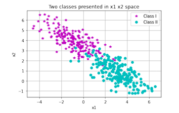

  <em>Figure 1. Artificially generated dataset.</em>

---

# Random Vectors and Their Properties

Distribution function:

$$
F_X(x)=Pr\{X\leq x\}
$$

Probability density function:

$$
f_X(x)=\frac{\partial F(x)}{\partial x}
$$

Distribution function can also be written as:

$$
F_X(x)=\int_{-\infty}^{x}f_X(\tau)d\tau
$$

Mathematical expectation:

$$
M_X=E\{X\}=\int x f_X(x)dx
$$

Covariance matrix:

$$
\Sigma=E\{(X-M_X)(X-M_X)^T\}
$$

---

# Sample Estimation Technique

  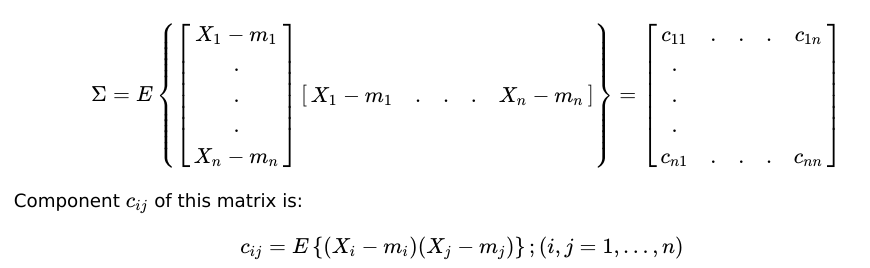

Arithmetic mean estimator:

$$
\hat{m}_Y=\frac{1}{N}\sum_{i=1}^{N}Y_i
$$

Variance estimator:

$$
\hat{\sigma}_Y^2=\frac{1}{N}\sum_{i=1}^{N}(Y_i-\hat{m}_Y)^2
$$

---

# Hypothesis Testing

The main goal of pattern recognition is to decide to which category observed sample belongs.  Based on observation or measurement a measurement vector is formed. This vector serves as an input to the decision rule through which this vector joins one of the analyzed classes.

**Hypothesis testing** is a whole family of methods solving this type of problem. These methods are very powerful, but they assume knowledge of joined probability density functions from all classes and this information is often unknown in practice.

In pattern recognition theory, we deal with random vectors gained from different classes and each of them is characterized with its distribution function and probability density function.

These functions are called conditional functions, and according to that, conditional probability density function for i-th class is noted as:

$$
f(x/w_i)
\quad \text{or} \quad
f_i(x),
\qquad i = 1,2,\ldots,L
$$

where \(w_i\) denotes class \(i\), and \(L\) is overall number of classes.

Unconditional probability density function of random vector \(X\), which is often called mixed density function, is given as:

$$
f(x)=\sum_{i=1}^{L} P_i f_i(x)
$$

where \(P_i\) denotes a priori probability of appearance of i-th class.

A posteriori probability of class when random vector \(X\) is given is noted as:

$$
P(w_i/x)
\quad \text{or} \quad
q_i(x)
$$

and can be calculated based on Bayesian theorem:

$$
q_i(x)=\frac{P_i f_i(x)}{f(x)}
$$

For our problem we assume that measurement vector is random vector whose conditional probability density function depends on class that sample comes from.

So far as these conditional probability density functions are known, then pattern recognition problem becomes statistical hypothesis testing problem.

We will observe case where we have two classes \(w_1\) and \(w_2\) whose a priori probabilities \(P_1\) and \(P_2\) are known, as well as corresponding a posteriori probability density functions:

$$
f_1(X)=f(X/w_1)
$$

$$
f_2(X)=f(X/w_2)
$$

---

# Bayesian Minimal Error Decision Rule

Let assume that we have measurement vector X and our task is to determine to which of two classes this vector belongs. Simple decision rule can be based on conditional probabilities
$$q_1(X) = Pr(w_1/X) $$ and $$q_2(X) = Pr(w_2/X)$$ as follows:

$$
q_1(X)>q_2(X)\Rightarrow X\in w_1
$$

$$
q_1(X)<q_2(X)\Rightarrow X\in w_2
$$

A posteriori probabilities \(q_i(X)\) represent conditional probability that sample \(X\) comes from class \(w_i\) if its numerical value is known, i.e. realization.

These probabilities can be calculated based on:
- a priori probabilities of classes appearance \(P_i\)
- a posteriori probability density functions of measurement vectors

$$
f_X = f_X(X/w_i)
$$

using Bayesian theorem:

$$
q_i(X)=\frac{f_i(X)P_i}{f(X)}
$$

$$
q_i(X)=\frac{f_i(X)P_i}
{f_1(X)P_1+f_2(X)P_2}
$$

Because mixed (a priori) probability density function is positive and joint for both a posteriori probabilities, decision rule can be written as:

$$
P_1f_1(X)>P_2f_2(X)
\Rightarrow X\in w_1
$$

$$
P_1f_1(X)<P_2f_2(X)
\Rightarrow X\in w_2
$$

or we can write above equations as follows:

  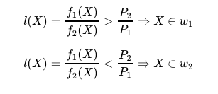

---

# Likelihood Ratio, Threshold Value and Discrimination Function

Expression \(l(X)\) is called **likelihood ratio**, and it is a very important quantity in pattern recognition theory.

Ratio:

$$
\frac{P_2}{P_1}
$$

is called **threshold value** in decision making.

It is common practice to apply negative logarithm on likelihood ratio, and then decision rule has form:

$$
h(X)=-\ln(l(X))
$$

$$
h(X)=
-\ln(f_1(X))
+
\ln(f_2(X))
<
\ln\left(\frac{P_1}{P_2}\right)
\Rightarrow X\in w_1
$$

$$
h(X)=
-\ln(f_1(X))
+
\ln(f_2(X))
     >
\ln\left(\frac{P_1}{P_2}\right)
\Rightarrow X\in w_1
$$

A sign of inequality changed direction because of negative logarithm use.

Expression \(h(X)\) is called **discrimination function**.

Further on we will consider that:

$$
P_1=P_2=0.5
$$

therefore:

$$
\ln\left(\frac{P_1}{P_2}\right)=0
$$

Stated rules above are called **Bayesian rule** or **minimal error decision test**.

For analysis of stated rule, it is very important to determine probability of decision error.

This classification rule cannot ensure perfect classification because classes overlap.

Conditional probability of error for measurement vector, noted as \(r(X)\), is equal to smaller of probabilities \(q_1(X)\) and \(q_2(X)\):

$$
r(X)=\min[q_1(X),q_2(X)]
$$

Total error, called Bayesian error, noted as \(\epsilon\), can be calculated as:

$$
\epsilon=
E\{r(X)\}
$$

$$
\epsilon=
\int r(X)f(X)dX
$$

$$
\epsilon=
\int \min[q_1(X),q_2(X)]f(X)dX
$$

$$
\epsilon=
\int \min[P_1f_1(X),P_2f_2(X)]dX
$$

$$
\epsilon=
P_1\int_{L_2}f_1(X)dX
+
P_2\int_{L_1}f_2(X)dX
$$

$$
\epsilon=P_1\epsilon_1+P_2\epsilon_2
$$

---

# Type I and Type II Error

$$
\epsilon_1=\int_{L_2}f_1(X)dX
$$

$$
\epsilon_2=\int_{L_1}f_2(X)dX
$$

Total Bayesian error:

$$
\epsilon=P_1\epsilon_1+P_2\epsilon_2
$$

---

# Normal Distribution of Random Vector

For our problem for artificially generated data random vector X is normally distributed.
If random vector X is normally distributed, its probability density function can be written as:

$$
N_X(M,\Sigma)=
\frac{1}{(2\pi)^{n/2}|\Sigma|^{1/2}}
\exp\left(-\frac{1}{2}(X-M)^T\Sigma^{-1}(X-M)\right)
$$

where \(N_X(M,\Sigma)\) is shortened notation for normal distribution with mathematical expectation \(M\) and covariance matrix \(\Sigma\).

Function:

$$
d^2(X)
$$

is called **statistical distance** (or \(d^2\) curve) of vector \(X\) from mathematical expectation vector \(M\).

---

# Discrimination Function

  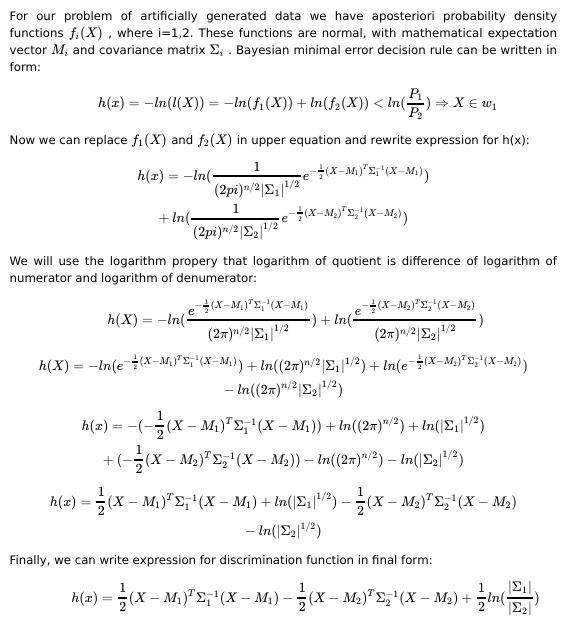

---

# Discrimination Function with Same Covariance Matrix

Last equation shows that decision boundary is quadratic function of \(X\).

If two classes have same covariance matrix, i.e.

$$
\Sigma_1=\Sigma_2=\Sigma
$$

decision boundary becomes linear function of \(X\) and can be written in next form:

$$
h(x)=
(M_2-M_1)^T\Sigma^{-1}X
                 +
\frac{1}{2}
\left(
M_1^T\Sigma^{-1}M_1
                 -
M_2^T\Sigma^{-1}M_2
\right)
$$

  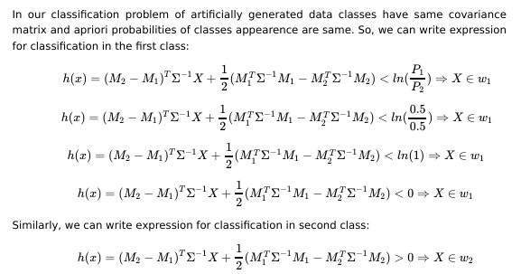

As we can see our classifier is line (we have linear function of X).

---

# Drawing of Decision Boundary

  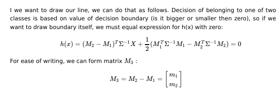

  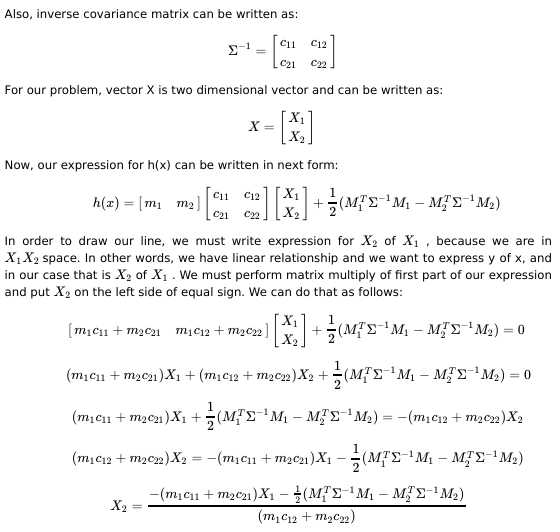

---

# Shapes of Bayesian Classifiers

In our classification problem covariance matrices are same, therefore discrimination function is line.

Shape of discrimination function depends on class distribution statistics.

Depending on classes distribution statistics, discrimination function can be:

1. Parabola  
2. Line  
3. Hyperbola  
4. Ellipse  

In literature we can often find for Bayesian classifier term **Naive Bayesian classifier**.

That is because this classifier has assumption that chosen features for classification problem are independent.

Because of this assumption we can write decision rules as they are described previously.

This assumption is not really justified, because in practice selected features are almost always dependent.

Although this assumption is naive, Bayesian classifier gives very good results in practice.

---

# Artificially Generated Dataset Visualization

Training dataset:

  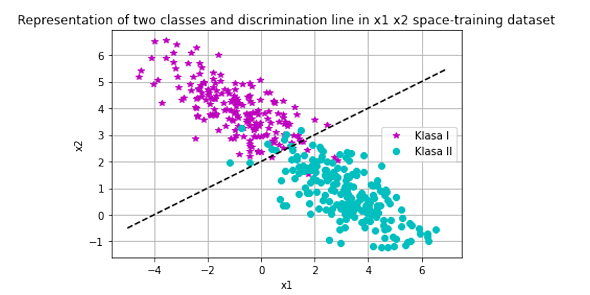

  <em>Figure 2. Training dataset and discrimination line.</em>

Testing dataset:

  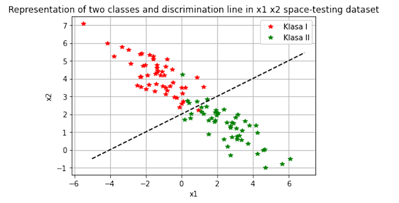

  <em>Figure 3. Testing dataset and discrimination line.</em>

---

# Second Classification Problem — Iris Dataset Classification

## Task

Choose two features for data representation and visualize discrimination lines in two-dimensional space. Perform Bayesian classification of Iris plant species.

## Description of Iris Dataset

The Iris dataset is one of the most well-known datasets in machine learning and pattern recognition.

The dataset contains three Iris plant species:

- Iris Setosa
- Iris Versicolor
- Iris Virginica

Classification is performed based on four features:

1. Sepal length  
2. Sepal width  
3. Petal length  
4. Petal width  

These features describe geometric characteristics of Iris flowers and allow separation between different species.

The dataset consists of five columns:
- first four columns represent features
- fifth column represents target class (species of Iris plant)

For a given combination of petal and sepal dimensions, the corresponding Iris species is known exactly.

Species of the Iris plant are shown in the following figure:

  

  <em>Figure 4. Species of Iris plant.</em>

We can observe that different Iris species have different petal and sepal dimensions, therefore these measurements are suitable for classification and discrimination between classes.

---

# Feature Selection

We will represent our dataset in two dimensions for ease of visualization. For that purpose, we will choose two features out of four. On the figures below are shown visualizations with two features, so we can decide which features are better for our classification problem.

## Petal Features

  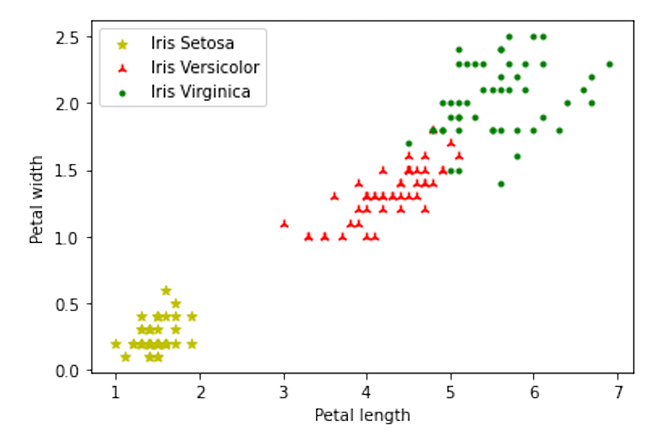

  <em>Figure 5. Petal features.</em>

## Sepal Features

  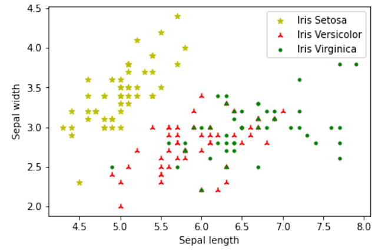

  <em>Figure 6. Sepal features.</em>

We can observe that with the selected features shown in Figure 5, classes are well separated and we can expect very good classification results.

On the other hand, with feature selection shown in Figure 6, there is significant overlap between classes *Iris Versicolor* and *Iris Virginica*.

Because of this overlap, these features do not provide good discrimination between classes, therefore they are not suitable for our classification problem.

---

# Discrimination Function with Different Covariance Matrix

  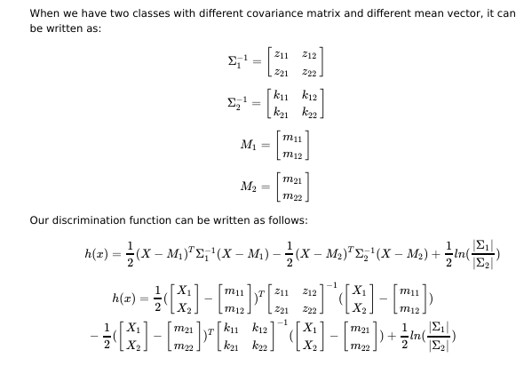

---

# Bayesian classifier for second classification problem

  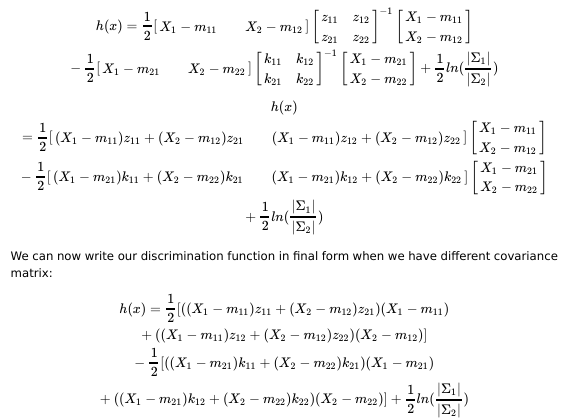

Equation above is parable. Again, we can see that shape of Bayesian classifier will depend of classes distribution statistic.

---

# Iris Dataset Classification Results

  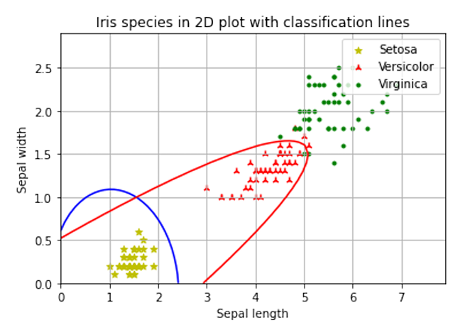

  <em>Figure 7. Bayesian classifier for Iris dataset.</em>

---

# Conclusions

This project demonstrates:

- Bayesian minimal error classification
- Linear and quadratic discrimination functions
- Importance of feature selection
- Influence of covariance matrices
- Practical implementation of Bayesian classifiers in Python
